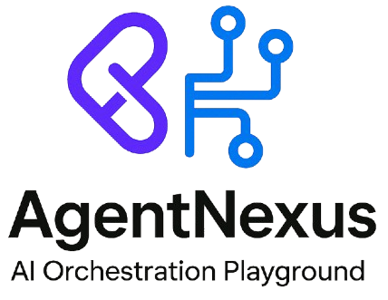
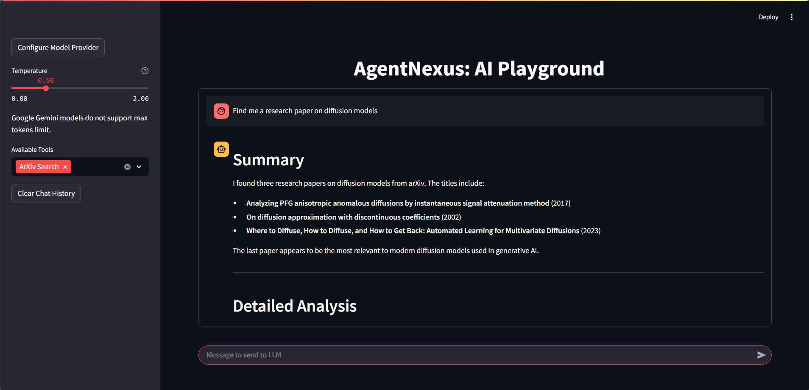

<p align="center">
    
</p>

# AgentNexus: AI Orchestration Playground

   


----
<p align="center"> 
<b>AgentNexus</b> is a powerful platform for orchestrating multiple AI agents to solve complex problems through a user-friendly interface. This tool allows you to leverage various language models with specialized tools in a conversational environment.
</p>
<p align="center">
    
</p>

---- 
## Features

- **Multiple LLM Provider Support**: Seamlessly connect to various AI providers including OpenAI, Azure OpenAI, Anthropic, Google Gemini, Groq, and local models via LM Studio
- **Integrated Tools**: Access specialized capabilities like Python execution, web scraping, research paper search, and financial data
- **Visualization**: Examine agent reasoning processes through interactive flow diagrams
- **Configurable Parameters**: Adjust temperature and max tokens parameters on-the-fly
- **Markdown Formatting**: Well-structured responses with proper Markdown formatting
- **Streamlit UI**: Clean and intuitive user interface with chat history

----

## Installation

```bash
# Clone the repository
git clone https://github.com/Gurneet1928/AgentNexus.git
cd AgentNexus

# Install dependencies
pip install -r requirements.txt
```

----

## Usage

```bash
# Run the Streamlit app
streamlit run main.py
```
or
```bash
python -m streamlit run main.py
```
----
## Configuration

1. Click "Configure Model Provider" in the sidebar
2. Select your preferred LLM provider
3. Enter the required credentials (API keys, etc.)
4. Select tools to use from the multiselect dropdown
5. Adjust temperature and max tokens as needed

The system prompt can be customized in `config.yaml`.

----
## Available Tools

- **Python REPL**: Execute Python code and return results
- **Word Length**: Count characters in a string
- **Website Scraper**: Extract text content from webpages
- **ArXiv Search**: Find academic papers on arXiv
- **Semantic Scholar**: Search for academic papers
- **Yahoo Finance**: Retrieve financial data and stock information
----
## Supported LLM Providers

- **LM Studio**: Run local models
- **Azure OpenAI**: Microsoft's Azure-hosted OpenAI models
- **OpenAI**: Direct access to OpenAI models
- **Groq**: High-performance inference
- **Anthropic**: Claude models
- **Google**: Gemini models
----
## Project Structure

```
AgentNexus/
├── .streamlit/            # Streamlit configuration
├── tools/                 # Agent tools
│   └── toolsHub.py        # Tool definitions
├── utilities/             # Helper functions
│   ├── providers.py       # LLM provider integrations
│   └── utils.py           # Utility functions
├── config.yaml            # System prompt configuration
├── main.py                # Main application
├── requirements.txt       # Dependencies
└── LICENSE                # MIT License
```
----
## License

🎉 **Good News!** 🎉 AgentNexus comes with the super-friendly MIT License! That means you can take it, make it, break it, and recreate it to your heart's content. Just remember to keep that LICENSE file hanging around so others know where this awesome project came from. It's like sharing a recipe - we just want credit for the original dish!

----
## Contributing

We love collaborators! Here's how you can join the AgentNexus community:

1. **Fork & Clone**: Get your own copy to play with
2. **Branch Out**: Create a feature branch (`git checkout -b amazing-feature`)
3. **Make Magic**: Implement your brilliant changes
4. **Test Thoroughly**: Make sure everything works smoothly
5. **Push With Pride**: (`git push origin amazing-feature`)
6. **PR Time**: Open a Pull Request with a clear description of your improvements

Don't worry about making it perfect - we value progress over perfection. Documentation improvements, bug fixes, feature additions, and UI enhancements are all welcome!

----
## Future Roadmap

AgentNexus is just getting started! Here are some exciting possibilities for the future:

- **Agent Memory**: Implement long-term memory for more context-aware conversations
- **Multi-Agent Collaboration**: Enable multiple agents to work together on complex tasks
- **Custom Tool Builder**: Interface for users to create their own specialized tools
- **Prompt Library**: Collection of optimized prompts for different use cases
- **Mobile Interface**: Responsive design for on-the-go AI orchestration
- **Voice Interaction**: Speak directly with your agent network
----
### Community Support Needed!

These ambitious goals need YOUR help! Whether you're a Python wizard, UI designer, or AI enthusiast, your contributions can make AgentNexus even more powerful. Interested in tackling one of these features? Open an issue to discuss your ideas or join our community Discord (coming soon).

Together, we can build the ultimate AI orchestration platform!

----
## 🎈 Thanks for Reading! 🎈

Thanks for reading! Now go forth and orchestrate some AI magic! ✨

Remember: with **great agents comes great responsibility**... and also really cool projects.

----

## The AI Afterparty 🎭

Side effects of using AgentNexus include speaking in JSON and debugging conversations in your dreams.

---- 

